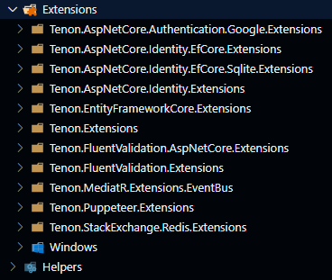
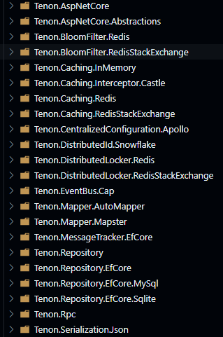

# Tenon

[](https://github.com/996icu/996.ICU/blob/master/LICENSE)

<h3 align="center">像搭积木一样按需构建项目功能</h3>

## ✨ 特性

- 🌈 服务治理：Consul
- 📦 分布式缓存：Redis
- 😎 分布式锁：Redis
- 🚀 布隆过滤器：Redis
- 🌟 分布式总线：Cap
- ⚙️ 分布式 ID：Snowflake
- 🎨 消息队列：RabbitMQ
- 🔒 数据库访问：Entity Framework Core & Repository
- 🌍 网关：Ocelot

## 🚀 结构

- Infrastructures 
  
- Extensions 
  
- Services 
  

## 📦 示例

- **数据访问** 
  
  定义实体
  
  ```csharp
  public class Blog : EfBasicAuditEntity, IConcurrency
  {
      public string Url { get; set; }
      public int Rating { get; set; }
      public virtual ICollection<Post> Posts { get; set; } = default!;
      public byte[] RowVersion { get; set; } = default!;
  }
  ```
  
  定义 DbContext
  
  ```csharp
  public sealed class MySqlTestDbContext(DbContextOptions options)
    : MySqlDbContext(options)
  {
    public DbSet<Blog> Blogs { get; set; }
    public DbSet<Post> Posts { get; set; }
  
    protected override void OnConfiguring(DbContextOptionsBuilder optionsBuilder)
    {
        // optionsBuilder.UseLazyLoadingProxies();
        optionsBuilder.EnableSensitiveDataLogging();
        optionsBuilder.LogTo(Console.WriteLine, LogLevel.Information);
    }
  
    protected override void OnModelCreating(ModelBuilder modelBuilder)
    {
        modelBuilder.Entity<Blog>().ToTable("blogs");
        modelBuilder.Entity<Post>().ToTable("posts");
        modelBuilder.ApplyConfigurations<MySqlTestDbContext>();
    }
  }
  ```
  
  依赖注入
  
  ```csharp
      private readonly IServiceProvider _serviceProvider;
      public EfRepositoryTests()
      {
          var configuration = new ConfigurationBuilder()
              .SetBasePath(Directory.GetCurrentDirectory())
              .AddJsonFile("appsettings.json", false)
              .Build();
  
          _serviceProvider = new ServiceCollection()
              .AddLogging(loggingBuilder => loggingBuilder
                  .AddConsole()
                  .SetMinimumLevel(LogLevel.Debug))
              .AddEfCoreMySql<MySqlTestDbContext>(configuration.GetSection("MySql"))
              .BuildServiceProvider();
      }
  ```
  
  单元测试
  
  ```csharp
    [TestInitialize]
    public async Task Init()
    {
        using (var scope = _serviceProvider.CreateScope())
        {
            using (var context = scope.ServiceProvider.GetService<MySqlTestDbContext>())
            {
                await context.Database.EnsureDeletedAsync();
                await context.Database.EnsureCreatedAsync();
                var blog1 = new Blog { Url = "http://sample.com", Id = 1 };
                var post1 = new Post { Blog = blog1, Content = "test", Title = "test" };
                var blogRepository = new EfRepository<Blog>(context);
                var result = await blogRepository.InsertAsync(blog1);
                Assert.AreEqual(result > 0, true);
                var postRepository = new EfRepository<Post>(context);
                result = await postRepository.InsertAsync(post1);
                Assert.AreEqual(result > 0, true);
  
                var blog2 = new Blog { Url = "http://sample2.com", Id = 2 };
                var post2 = new Post { Blog = blog2, Content = "test2", Title = "test2" };
                result = await blogRepository.InsertAsync(blog2);
                Assert.AreEqual(result > 0, true);
                result = await postRepository.InsertAsync(post2);
                Assert.AreEqual(result > 0, true);
  
                var blog3 = new Blog { Url = "http://sample4.com", Id = 3 };
                var post3 = new Post { Blog = blog3, Content = "test3", Title = "test3" };
                result = await blogRepository.InsertAsync(blog3);
                Assert.AreEqual(result > 0, true);
                result = await postRepository.InsertAsync(post3);
                Assert.AreEqual(result > 0, true);
  
                var blog4 = new Blog { Url = "http://sample4.com", Id = 4 };
                var post4 = new Post { Blog = blog4, Content = "test4", Title = "test4" };
                result = await blogRepository.InsertAsync(blog4);
                Assert.AreEqual(result > 0, true);
                result = await postRepository.InsertAsync(post4);
                Assert.AreEqual(result > 0, true);
            }
        }
    }
  ```

- **分布式缓存**
  
  依赖注入
  
  ```csharp
      var configuration = new ConfigurationBuilder()
            .SetBasePath(Directory.GetCurrentDirectory())
            .AddJsonFile("appsettings.json", false)
            .Build();
        _serviceProvider = new ServiceCollection()
            .AddLogging(loggingBuilder => loggingBuilder
                .AddConsole()
                .SetMinimumLevel(LogLevel.Debug))
            .AddSystemTextJsonSerializer()
            .AddRedisStackExchangeProvider(configuration.GetSection("Redis"))
            .AddKeyedRedisStackExchangeProvider(_serviceKey, configuration.GetSection("Redis2"))
            .AddKeyedRedisStackExchangeProvider("abc", configuration.GetSection("Redis2"))
            .BuildServiceProvider();
  ```
  
  单元测试 
  
  ```csharp
      using (var scope = _serviceProvider.CreateScope())
      {
          var redisProvider = scope.ServiceProvider.GetRequiredKeyedService<IRedisProvider>(_serviceKey);
          var actual = redisProvider?.IncrBy($"test_{DateTime.Now:yyyyMMddHHmmss}");
          Assert.AreEqual(1, actual);
      }
  ```

- 布隆过滤器
  
  依赖注入
  
  ```csharp
      public RedisBloomFilterTests()
      {
          Console.WriteLine("RedisBloomFilterTests");
          var configuration = new ConfigurationBuilder()
              .SetBasePath(Directory.GetCurrentDirectory())
              .AddJsonFile("appsettings.json", false)
              .Build();
          _serviceProvider = new ServiceCollection()
              .AddLogging(loggingBuilder => loggingBuilder
                  .SetMinimumLevel(LogLevel.Debug))
              .AddBloomFilter(opt =>
              {
                  opt.Name = "test";
                  opt.Capacity = 1000;
                  opt.ErrorRate = 0.01;
                  opt.UseRedisStackExchange(configuration.GetSection("Redis"));
              })
              .AddBloomFilter(opt =>
              {
                  opt.Name = "test1";
                  opt.Capacity = 1000;
                  opt.ErrorRate = 0.01;
                  opt.UseRedisStackExchange(configuration.GetSection("Redis"));
              })
              .AddBloomFilter(opt =>
              {
                  opt.Name = "test2";
                  opt.Capacity = 1000;
                  opt.ErrorRate = 0.01;
                  opt.UseRedisStackExchange(configuration.GetSection("Redis"));
              })
              .AddBloomFilter(opt =>
              {
                  opt.Name = "testKeyed";
                  opt.Capacity = 1000;
                  opt.ErrorRate = 0.01;
                  opt.KeyedServiceKey = "RedisBloomFilterTests";
                  opt.UseRedisStackExchange(configuration.GetSection("Redis"));
              })
              .AddBloomFilter(opt =>
              {
                  opt.Name = "testKeyed1";
                  opt.Capacity = 1000;
                  opt.ErrorRate = 0.01;
                  opt.KeyedServiceKey = "RedisBloomFilterTests1";
                  opt.UseRedisStackExchange(configuration.GetSection("Redis"));
              })
              .BuildServiceProvider();
      }
  ```
  
    单元测试
  
  ```csharp
  [TestMethod]
  public async Task AddAsyncTest_1()
  {
      using (var scope = _serviceProvider.CreateScope())
      {
          var bloomFilter = scope.ServiceProvider.GetService<IBloomFilter>();
          var bloomFilters = scope.ServiceProvider.GetServices<IBloomFilter>();
          Assert.AreEqual(3, bloomFilters?.Count());
  
          Console.WriteLine($"AddAsyncTest_1 value {_boomFilterValue}");
          var actual = await bloomFilter.AddAsync(_boomFilterValue);
          Assert.IsTrue(actual);
      }
  }
  ```

- ***WebAPI***
  
  Controller定义，继承实现AbstractController
  
  ```csharp
  [Route("api/[controller]")]
  [ApiController]
  [AuthorizeScope([], AuthenticationSchemes = JwtBearerDefaults.AuthenticationScheme)]
  public class UserController : AbstractController
  {
      private readonly IUserService _userService;
  
      public UserController(IUserService userService)
      {
          _userService = userService;
      }
  
      [AllowAnonymous]
      [HttpPost]
      public async Task<ActionResult<long>> CreateAsync([FromBody] UserCreationDto input)
      {
          return CreatedResult(await _userService.CreateAsync(input));
      }
  
      [HttpPut("{id}")]
      [ProducesResponseType(StatusCodes.Status204NoContent)]
      public async Task<ActionResult> UpdateAsync([FromRoute] long id, [FromBody] UserUpdationDto input)
      {
          return Result(await _userService.UpdateAsync(id, input));
      }
  
      [HttpDelete("{id}")]
      [ProducesResponseType(StatusCodes.Status204NoContent)]
      public async Task<ActionResult> DeleteAsync([FromRoute] long id)
      {
          return Result(await _userService.DeleteAsync(id));
      }
  
      [HttpGet("page")]
      [ProducesResponseType(StatusCodes.Status200OK)]
      public async Task<ActionResult<PagedResultDto<UserDto>>> GetPagedAsync([FromQuery] UserSearchPagedDto search)
      {
          return await _userService.GetPagedAsync(search);
      }
  }
  ```
  
    认证授权
  
  ```csharp
  builder.Services.ConfigureJwtBearerAuthenticationOptions<IdentityAuthenticationHandler>(
      builder.Configuration.GetSection("Jwt"), options => options.OnTokenValidated =
          context =>
          {
              var userContext = context.HttpContext.RequestServices.GetService<UserContext>() ??
                                  throw new NullReferenceException(nameof(UserContext));
              var principal = context.Principal ??
                              throw new NullReferenceException(nameof(context.Principal));
              var claims = principal.Claims;
              userContext.Id = long.Parse(claims.First(x =>
                  x.Type == ClaimTypes.NameIdentifier).Value);
              userContext.Account = claims.First(x => x.Type == JwtRegisteredClaimNames.UniqueName).Value;
              userContext.Name = claims.First(x => x.Type == ClaimTypes.Name).Value;
              userContext.RoleIds = claims.First(x => x.Type == IdentityRegisteredClaimNames.DeptId).Value;
              Console.WriteLine("OnTokenValidated");
              return Task.CompletedTask;
          });
  ```
